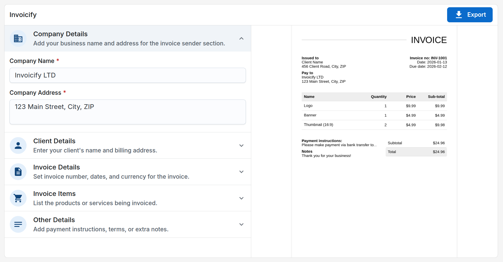

# Invoicify

**Create Beautiful Invoices Instantly**

Invoicify lets you generate professional invoices in seconds. Export high-quality PDFs or images with ease. Simple, fast, and hassle-free — perfect for freelancers, small businesses, and startups.

**Live Demo -** https://invoicify-d0.netlify.app/



## Features

- **Easy-to-Use Editor**  
  An intuitive interface that lets you build invoices without any design or technical skills.

- **Download as PDF or Image**  
  Export your invoice as a high-quality PDF or image with a single click.

- **Customizable Templates**  
  Choose from clean, modern templates and customize them with your branding.

- **Multi-Currency & Locale Support**  
  Automatically formats currencies and dates based on locale — ideal for global clients.

## Technologies Used

- React  
- React Router DOM  
- React Hook Form  
- Yup  
- React-pdf  

## Getting Started

Follow these steps to run the project locally:

### Installation

```bash
npm install
```

### Run the Dev Server

```bash
npm run dev
```